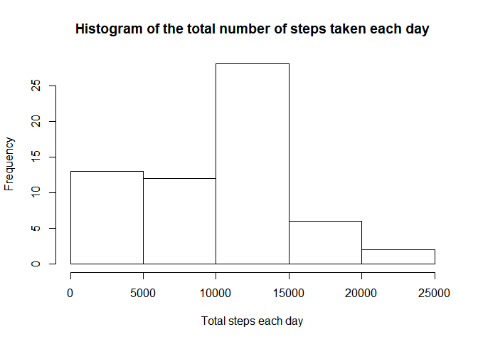
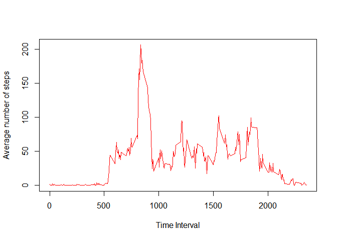
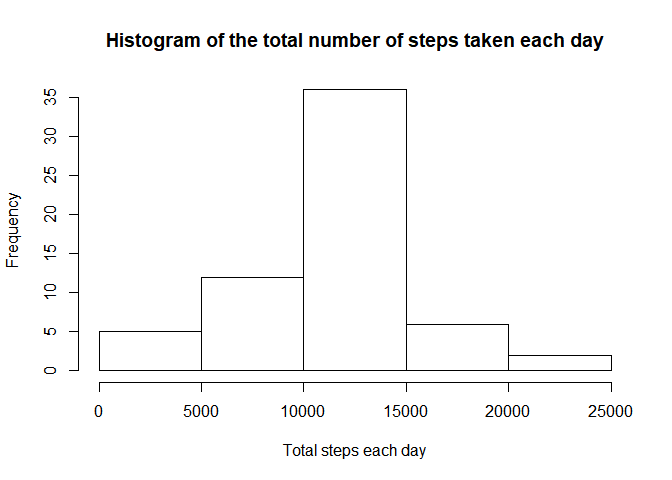
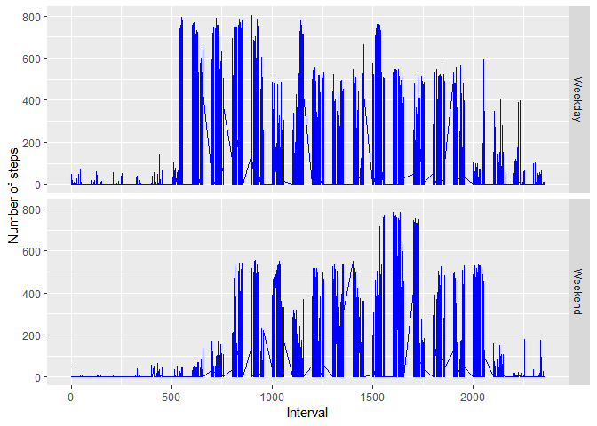

```
## 
## Attaching package: 'dplyr'
```

```
## The following objects are masked from 'package:stats':
## 
##     filter, lag
```

```
## The following objects are masked from 'package:base':
## 
##     intersect, setdiff, setequal, union
```

First of all, lets load the data and convert the columns to the required data types.


```r
library(xtable)
library(dplyr)
download.file("https://d396qusza40orc.cloudfront.net/repdata%2Fdata%2Factivity.zip","activity.zip")
actFile <- unzip("activity.zip")
actDf <- read.table(actFile, header = TRUE, sep = ",", na.strings = "NA", colClasses = c("numeric","character","numeric"))
actDf$date <- as.Date(actDf$date,"%Y-%m-%d")
```

Let us analyse more about the number of steps taken on each day.
The below histogram dsplays the data distribution of the total number of steps taken on each day


```r
actT <- tbl_df(actDf)
actSummary <- actT %>%
  group_by(date) %>%
  summarise(dt_sum = sum(steps, na.rm = TRUE), dt_mean = mean(steps, na.rm = TRUE), dt_median = median(steps, na.rm = TRUE))
hist(actSummary$dt_sum, xlab = "Total steps each day", main = "Histogram of the total number of steps taken each day")
```

<!-- -->

The below table displays the mean and median of the total number of steps taken on each day.


```r
subActSum <- actSummary[,c(1,3,4)]
names(subActSum) <- c("Date", "Mean Steps", "Median Steps")
xt <- xtable(subActSum)
xt$Date <- as.character(xt$Date)
print(xt, type="html")
```

<!-- html table generated in R 3.3.3 by xtable 1.8-2 package -->
<!-- Wed Aug 29 16:13:30 2018 -->
<table border=1>
<tr> <th>  </th> <th> Date </th> <th> Mean Steps </th> <th> Median Steps </th>  </tr>
  <tr> <td align="right"> 1 </td> <td align="right"> 2012-10-01 </td> <td align="right">  </td> <td align="right">  </td> </tr>
  <tr> <td align="right"> 2 </td> <td align="right"> 2012-10-02 </td> <td align="right"> 0.44 </td> <td align="right"> 0.00 </td> </tr>
  <tr> <td align="right"> 3 </td> <td align="right"> 2012-10-03 </td> <td align="right"> 39.42 </td> <td align="right"> 0.00 </td> </tr>
  <tr> <td align="right"> 4 </td> <td align="right"> 2012-10-04 </td> <td align="right"> 42.07 </td> <td align="right"> 0.00 </td> </tr>
  <tr> <td align="right"> 5 </td> <td align="right"> 2012-10-05 </td> <td align="right"> 46.16 </td> <td align="right"> 0.00 </td> </tr>
  <tr> <td align="right"> 6 </td> <td align="right"> 2012-10-06 </td> <td align="right"> 53.54 </td> <td align="right"> 0.00 </td> </tr>
  <tr> <td align="right"> 7 </td> <td align="right"> 2012-10-07 </td> <td align="right"> 38.25 </td> <td align="right"> 0.00 </td> </tr>
  <tr> <td align="right"> 8 </td> <td align="right"> 2012-10-08 </td> <td align="right">  </td> <td align="right">  </td> </tr>
  <tr> <td align="right"> 9 </td> <td align="right"> 2012-10-09 </td> <td align="right"> 44.48 </td> <td align="right"> 0.00 </td> </tr>
  <tr> <td align="right"> 10 </td> <td align="right"> 2012-10-10 </td> <td align="right"> 34.38 </td> <td align="right"> 0.00 </td> </tr>
  <tr> <td align="right"> 11 </td> <td align="right"> 2012-10-11 </td> <td align="right"> 35.78 </td> <td align="right"> 0.00 </td> </tr>
  <tr> <td align="right"> 12 </td> <td align="right"> 2012-10-12 </td> <td align="right"> 60.35 </td> <td align="right"> 0.00 </td> </tr>
  <tr> <td align="right"> 13 </td> <td align="right"> 2012-10-13 </td> <td align="right"> 43.15 </td> <td align="right"> 0.00 </td> </tr>
  <tr> <td align="right"> 14 </td> <td align="right"> 2012-10-14 </td> <td align="right"> 52.42 </td> <td align="right"> 0.00 </td> </tr>
  <tr> <td align="right"> 15 </td> <td align="right"> 2012-10-15 </td> <td align="right"> 35.20 </td> <td align="right"> 0.00 </td> </tr>
  <tr> <td align="right"> 16 </td> <td align="right"> 2012-10-16 </td> <td align="right"> 52.38 </td> <td align="right"> 0.00 </td> </tr>
  <tr> <td align="right"> 17 </td> <td align="right"> 2012-10-17 </td> <td align="right"> 46.71 </td> <td align="right"> 0.00 </td> </tr>
  <tr> <td align="right"> 18 </td> <td align="right"> 2012-10-18 </td> <td align="right"> 34.92 </td> <td align="right"> 0.00 </td> </tr>
  <tr> <td align="right"> 19 </td> <td align="right"> 2012-10-19 </td> <td align="right"> 41.07 </td> <td align="right"> 0.00 </td> </tr>
  <tr> <td align="right"> 20 </td> <td align="right"> 2012-10-20 </td> <td align="right"> 36.09 </td> <td align="right"> 0.00 </td> </tr>
  <tr> <td align="right"> 21 </td> <td align="right"> 2012-10-21 </td> <td align="right"> 30.63 </td> <td align="right"> 0.00 </td> </tr>
  <tr> <td align="right"> 22 </td> <td align="right"> 2012-10-22 </td> <td align="right"> 46.74 </td> <td align="right"> 0.00 </td> </tr>
  <tr> <td align="right"> 23 </td> <td align="right"> 2012-10-23 </td> <td align="right"> 30.97 </td> <td align="right"> 0.00 </td> </tr>
  <tr> <td align="right"> 24 </td> <td align="right"> 2012-10-24 </td> <td align="right"> 29.01 </td> <td align="right"> 0.00 </td> </tr>
  <tr> <td align="right"> 25 </td> <td align="right"> 2012-10-25 </td> <td align="right"> 8.65 </td> <td align="right"> 0.00 </td> </tr>
  <tr> <td align="right"> 26 </td> <td align="right"> 2012-10-26 </td> <td align="right"> 23.53 </td> <td align="right"> 0.00 </td> </tr>
  <tr> <td align="right"> 27 </td> <td align="right"> 2012-10-27 </td> <td align="right"> 35.14 </td> <td align="right"> 0.00 </td> </tr>
  <tr> <td align="right"> 28 </td> <td align="right"> 2012-10-28 </td> <td align="right"> 39.78 </td> <td align="right"> 0.00 </td> </tr>
  <tr> <td align="right"> 29 </td> <td align="right"> 2012-10-29 </td> <td align="right"> 17.42 </td> <td align="right"> 0.00 </td> </tr>
  <tr> <td align="right"> 30 </td> <td align="right"> 2012-10-30 </td> <td align="right"> 34.09 </td> <td align="right"> 0.00 </td> </tr>
  <tr> <td align="right"> 31 </td> <td align="right"> 2012-10-31 </td> <td align="right"> 53.52 </td> <td align="right"> 0.00 </td> </tr>
  <tr> <td align="right"> 32 </td> <td align="right"> 2012-11-01 </td> <td align="right">  </td> <td align="right">  </td> </tr>
  <tr> <td align="right"> 33 </td> <td align="right"> 2012-11-02 </td> <td align="right"> 36.81 </td> <td align="right"> 0.00 </td> </tr>
  <tr> <td align="right"> 34 </td> <td align="right"> 2012-11-03 </td> <td align="right"> 36.70 </td> <td align="right"> 0.00 </td> </tr>
  <tr> <td align="right"> 35 </td> <td align="right"> 2012-11-04 </td> <td align="right">  </td> <td align="right">  </td> </tr>
  <tr> <td align="right"> 36 </td> <td align="right"> 2012-11-05 </td> <td align="right"> 36.25 </td> <td align="right"> 0.00 </td> </tr>
  <tr> <td align="right"> 37 </td> <td align="right"> 2012-11-06 </td> <td align="right"> 28.94 </td> <td align="right"> 0.00 </td> </tr>
  <tr> <td align="right"> 38 </td> <td align="right"> 2012-11-07 </td> <td align="right"> 44.73 </td> <td align="right"> 0.00 </td> </tr>
  <tr> <td align="right"> 39 </td> <td align="right"> 2012-11-08 </td> <td align="right"> 11.18 </td> <td align="right"> 0.00 </td> </tr>
  <tr> <td align="right"> 40 </td> <td align="right"> 2012-11-09 </td> <td align="right">  </td> <td align="right">  </td> </tr>
  <tr> <td align="right"> 41 </td> <td align="right"> 2012-11-10 </td> <td align="right">  </td> <td align="right">  </td> </tr>
  <tr> <td align="right"> 42 </td> <td align="right"> 2012-11-11 </td> <td align="right"> 43.78 </td> <td align="right"> 0.00 </td> </tr>
  <tr> <td align="right"> 43 </td> <td align="right"> 2012-11-12 </td> <td align="right"> 37.38 </td> <td align="right"> 0.00 </td> </tr>
  <tr> <td align="right"> 44 </td> <td align="right"> 2012-11-13 </td> <td align="right"> 25.47 </td> <td align="right"> 0.00 </td> </tr>
  <tr> <td align="right"> 45 </td> <td align="right"> 2012-11-14 </td> <td align="right">  </td> <td align="right">  </td> </tr>
  <tr> <td align="right"> 46 </td> <td align="right"> 2012-11-15 </td> <td align="right"> 0.14 </td> <td align="right"> 0.00 </td> </tr>
  <tr> <td align="right"> 47 </td> <td align="right"> 2012-11-16 </td> <td align="right"> 18.89 </td> <td align="right"> 0.00 </td> </tr>
  <tr> <td align="right"> 48 </td> <td align="right"> 2012-11-17 </td> <td align="right"> 49.79 </td> <td align="right"> 0.00 </td> </tr>
  <tr> <td align="right"> 49 </td> <td align="right"> 2012-11-18 </td> <td align="right"> 52.47 </td> <td align="right"> 0.00 </td> </tr>
  <tr> <td align="right"> 50 </td> <td align="right"> 2012-11-19 </td> <td align="right"> 30.70 </td> <td align="right"> 0.00 </td> </tr>
  <tr> <td align="right"> 51 </td> <td align="right"> 2012-11-20 </td> <td align="right"> 15.53 </td> <td align="right"> 0.00 </td> </tr>
  <tr> <td align="right"> 52 </td> <td align="right"> 2012-11-21 </td> <td align="right"> 44.40 </td> <td align="right"> 0.00 </td> </tr>
  <tr> <td align="right"> 53 </td> <td align="right"> 2012-11-22 </td> <td align="right"> 70.93 </td> <td align="right"> 0.00 </td> </tr>
  <tr> <td align="right"> 54 </td> <td align="right"> 2012-11-23 </td> <td align="right"> 73.59 </td> <td align="right"> 0.00 </td> </tr>
  <tr> <td align="right"> 55 </td> <td align="right"> 2012-11-24 </td> <td align="right"> 50.27 </td> <td align="right"> 0.00 </td> </tr>
  <tr> <td align="right"> 56 </td> <td align="right"> 2012-11-25 </td> <td align="right"> 41.09 </td> <td align="right"> 0.00 </td> </tr>
  <tr> <td align="right"> 57 </td> <td align="right"> 2012-11-26 </td> <td align="right"> 38.76 </td> <td align="right"> 0.00 </td> </tr>
  <tr> <td align="right"> 58 </td> <td align="right"> 2012-11-27 </td> <td align="right"> 47.38 </td> <td align="right"> 0.00 </td> </tr>
  <tr> <td align="right"> 59 </td> <td align="right"> 2012-11-28 </td> <td align="right"> 35.36 </td> <td align="right"> 0.00 </td> </tr>
  <tr> <td align="right"> 60 </td> <td align="right"> 2012-11-29 </td> <td align="right"> 24.47 </td> <td align="right"> 0.00 </td> </tr>
  <tr> <td align="right"> 61 </td> <td align="right"> 2012-11-30 </td> <td align="right">  </td> <td align="right">  </td> </tr>
   </table>

Let us now try to understand the average daily activity pattern
Below is a time series plot of the 5-minute interval and the average number of steps taken, averaged across all days.

```r
actIntSummary <- actT %>%
  group_by(interval) %>%
  summarise(int_sum = sum(steps, na.rm = TRUE), int_mean = mean(steps, na.rm = TRUE), int_median = median(steps, na.rm = TRUE))
plot(actIntSummary$interval, actIntSummary$int_mean, type = "l", col = "red", xlab = "Time Interval", ylab = "Average number of steps")
```

<!-- -->

```r
actIntOrder <- head(arrange(actIntSummary, desc(int_sum)),1)
maxInt <- actIntOrder$interval
maxStep <- actIntOrder$int_mean
```
The 835 5-minute interval has the maximum number of average steps (206.1698113)

Note that there are a number of days/intervals where there are missing values. 

```r
cntNAs <- sum(is.na(actDf$steps))
```
There are `r cntNAs' records with missing step counts for a given day/interval. We will now try to fill all of the missing values in the dataset with the the mean for that 5-minute interval to build the final tidy dataset.


```r
actMerged <- merge(actDf,actIntSummary, by.x = "interval", by.y = "interval")

for(i in 1:nrow(actMerged)){
  if(is.na(actMerged$steps[i])) {
    actMerged$steps[i] <- actMerged$int_mean[i]
  }
}
actFinal <- actMerged[,c(1:3)]
```

Below is a histogram of the total number of steps taken each day and Calculate and report the mean and median total number of steps taken per day. 


```r
actFinalT <- tbl_df(actFinal)
actFinalSumm <- actFinalT %>%
  group_by(date) %>%
  summarise(dt_sum = sum(steps, na.rm = TRUE), dt_mean = mean(steps, na.rm = TRUE), dt_median = median(steps, na.rm = TRUE))
hist(actFinalSumm$dt_sum, xlab = "Total steps each day", main = "Histogram of the total number of steps taken each day")
```

<!-- -->

Let us now assess the impact of imputing the missing data.
Below is the summary statistics of the original data set which had missing values

```r
summary(actSummary$dt_sum)
```

   Min. 1st Qu.  Median    Mean 3rd Qu.    Max. 
      0    6778   10400    9354   12810   21190 

Below is the summary statistics of the final data set after imputing the missing values.

```r
summary(actFinalSumm$dt_sum)
```

   Min. 1st Qu.  Median    Mean 3rd Qu.    Max. 
     41    9819   10770   10770   12810   21190 

We conclude that there is not much significance difference after imputing the NAs.

Finally, let us analyse differences in activity patterns between weekdays and weekends


```r
actFinal$day_type <- weekdays(actFinal$date)
setDayType <- function(x){
  if(x == "Saturday" | x == "Sunday"){
    "Weekend"
  } else "Weekday"
}
actFinal$day_type <- sapply(actFinal$day_type,setDayType)
actFinal$day_type <- factor(actFinal$day_type, levels = c("Weekday","Weekend"))
g <- ggplot(actFinal, aes(interval, steps))
g + geom_line(color = "blue") + facet_grid(day_type~.) + xlab("Interval") + ylab("Number of steps")
```

<!-- -->
